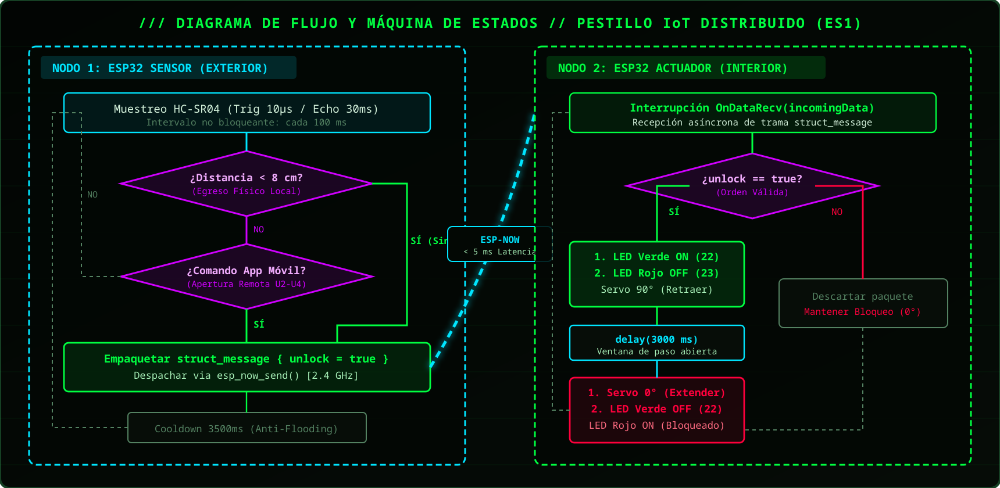
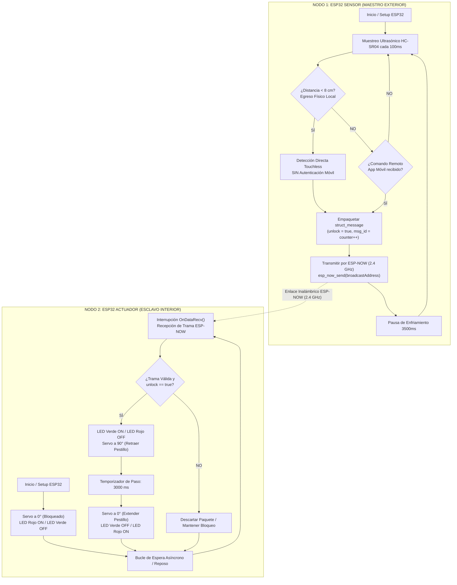
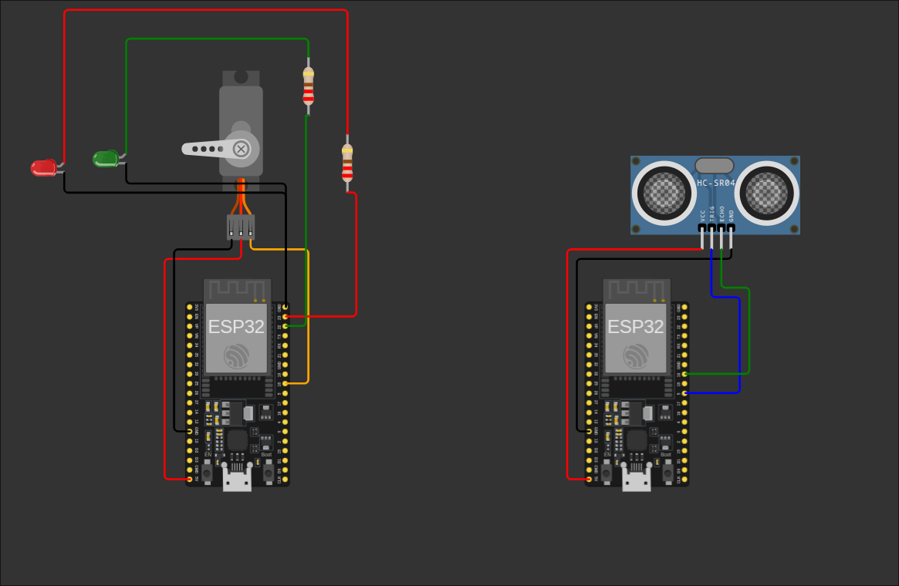
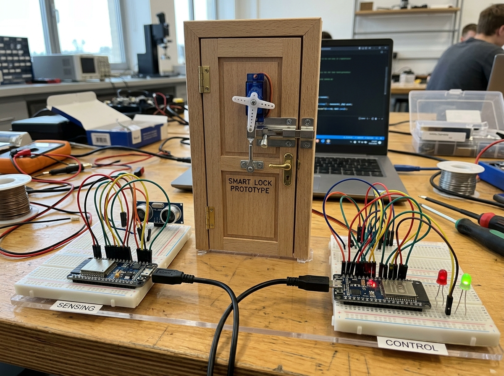

# **INFORME DE EVALUACIÓN SUMATIVA 1 (ES1)**

## **SISTEMA DE PESTILLO INTELIGENTE IoT DISTRIBUIDO**

**Asignatura:** Aplicaciones Móviles para IoT (TI3042)  
**Institución:** INACAP - Ingeniería en Informática  
**Unidad de Aprendizaje:** Unidad 1: Introducción a IoT y Smart Devices  
**Aprendizaje Esperado:** 1.1 Utiliza dispositivos IoT para interconexión con dispositivos externos de forma segura, de acuerdo a estándares de seguridad de la industria.  
**Integrantes:** Nicolás Anrique, Camilo Núñez, Diego Ibeas  
**Fecha de Entrega:** Septiembre de 2026  

---

## **I. Planteamiento de la Problemática y Solución IoT (Paso 1)**
*Criterio de Evaluación 1.1.1 y 1.1.3*

Los sistemas convencionales de control de acceso perimetral que concentran la interfaz de lectura exterior (teclados, lectores biométricos o pulsadores) y el actuador mecánico (cerradura electromagnética, solenoide o servomotor) en un único gabinete físico son vulnerables a vulneración por sobretensión o manipulación física. Si un atacante desmonta el panel frontal expuesto a la vía pública, accede de forma directa al cableado de control y puede forzar la apertura del recinto puenteando las líneas de alimentación.

Para resolver este desafío de seguridad física y lógica bajo estándares de la industria, se diseñó un **Sistema de Pestillo Inteligente IoT Distribuido en dos nodos** desacoplados eléctricamente:

1. **Nodo Sensor (Perímetro Exterior):** Unidad de sensado por ultrasonido (HC-SR04) que detecta la presencia del usuario a corta distancia (< 8 cm). Opera como un mecanismo de egreso libre local (*Request-to-Exit*) sin contacto físico y sin compartir cableado de control con el mecanismo de tracción interior.
2. **Nodo Actuador (Zona Segura Interior):** Unidad de potencia aislada en el marco interior de la puerta que acciona el servomotor SG90 acoplado al pestillo corredizo y señaliza el estado mediante diodos LED (Verde/Rojo).

La interconexión entre ambos microcontroladores se realiza exclusivamente de forma inalámbrica mediante el protocolo **ESP-NOW** en la banda de 2.4 GHz, garantizando que la destrucción o sabotaje del nodo perimetral exterior no afecte mecánicamente la retención de la puerta.

### **Proyección y Escalabilidad hacia la Aplicación Móvil (Visión Curricular Unidades 2, 3 y 4)**
En concordancia con el objetivo terminal de la asignatura TI3042 (*Aplicaciones Móviles para IoT*), este prototipo distribuido M2M (Machine-to-Machine) está diseñado como la capa de infraestructura base. En las siguientes unidades (2, 3 y 4), el **Nodo Actuador Interior** asumirá el rol de *Gateway Periférico* (aprovechando la pila dual Wi-Fi/Bluetooth del ESP32), enlazándose directamente con una **aplicación móvil nativa (Flutter / Android)**. Esto permitirá al usuario:
* **Monitorear en tiempo real** el estado del cerrojo (abierto/cerrado) y el registro histórico de eventos de egreso con marcas de tiempo.
* **Comandar aperturas remotas** cifradas mediante autenticación biométrica móvil.
* **Recibir alertas de seguridad** ante intentos de manipulación o detecciones anómalas en el perímetro exterior.

---

## **II. Identificación, Descripción y Justificación Técnica de Componentes (Pasos 3 y 4)**
*Criterio de Evaluación 1.1.1*

A continuación se detallan los elementos de hardware seleccionados para la solución, especificando sus características de hoja de datos y su rol dentro del ecosistema embebido:

| Componente | Clasificación | Especificación Técnica | Función Detallada en la Solución |
| :--- | :--- | :--- | :--- |
| **ESP32 DevKit v4 (Nodo Sensor)** | Unidad de Cómputo Perimetral | SoC Tensilica Xtensa Dual-Core 32-bit @ 240MHz, 520KB SRAM, radio Wi-Fi 802.11 b/g/n nativo, protocolo ESP-NOW. | Ubicado en el exterior. Muestrea el sensor ultrasónico cada 100 ms y genera la trama de apertura por radiofrecuencia hacia el nodo interior. |
| **ESP32 DevKit v4 (Nodo Actuador)** | Unidad de Cómputo Segura | SoC Tensilica Xtensa Dual-Core 32-bit @ 240MHz, generación de señales PWM por hardware (periférico LEDC). | Ubicado en el interior protegido. Recibe la trama inalámbrica, procesa la interrupción y controla la apertura angular del servomotor. |
| **HC-SR04** | Sensor Ultrasónico de Proximidad | Transductor acústico 40 kHz, tensión 5V DC, rango: 2 cm a 400 cm, resolución: 0.3 cm, ángulo de apertura: 15°. | Detecta la mano del usuario a menos de 8 cm, implementando la apertura automática por proximidad sin contacto (*Touchless*). |
| **Micro Servomotor SG90** | Actuador Electromecánico | Motor DC con caja reductora y potenciómetro interno, torque: 1.8 kg·cm @ 4.8V, modulación PWM a 50 Hz. | Ejerce la tracción mecánica sobre el pestillo corredizo: 90° (desbloqueado/retraído) durante 3000 ms y 0° (bloqueado/extendido en reposo). |
| **Diodos LED (Verde / Rojo) 5mm** | Indicadores Ópticos de Estado | Tensión directa 1.9V - 2.1V, corriente máx 20mA, con resistencias limitadoras de 220Ω (GPIO 22 y 23). | Señalizan visualmente el estado: **Rojo** para cerradura bloqueada (reposo) y **Verde** para acceso concedido (pestillo retraído). |
| **Resistencias de 220Ω (x2)** | Componentes Pasivos | Película de carbón 1/4W, tolerancia ±5%. | Limitan la corriente de salida de los pines GPIO del ESP32 a ~10 mA, protegiendo los puertos y los diodos LED. |
| **Protoboards y Jumpers** | Infraestructura de Montaje | 2× Protoboards de 400 puntos y cables macho-macho / macho-hembra. | Distribución de buses de alimentación (5V/GND) e interconexión de señales en ambos nodos. |

### **Justificación Técnica de la Elección de Componentes (Paso 3)**
La selección de cada elemento responde directamente a los requerimientos de la problemática:

1. **Protocolo Inalámbrico ESP-NOW (Wi-Fi 2.4 GHz) vs. Bluetooth / Cableado Serial:**
   * **Latencia Ultra-Baja:** ESP-NOW opera en la capa de enlace de datos (Data Link Layer) sin handshake de conexión TCP/IP ni emparejamiento previo (a diferencia de Bluetooth Classic/BLE), logrando tiempos de despacho inferiores a 5 ms.
   * **Alcance y Penetración Estructural:** En la banda de 2.4 GHz con modulación Wi-Fi nativa, alcanza coberturas de hasta 100-200 metros en línea de vista, garantizando la penetración a través de muros de concreto o puertas blindadas donde BLE experimenta atenuación severa.
   * **Soberanía Operativa Offline:** No requiere routers, puntos de acceso ni conectividad a Internet para operar, manteniendo el control de acceso 100% disponible ante caídas de red externa.

2. **Sensor Ultrasónico HC-SR04 vs. Infrarrojos (PIR / IR Reflexivo):**
   * **Inmunidad a la Radiación Solar y Temperatura Exterior:** Los sensores infrarrojos pasivos (PIR) y fototransistores sufren falsos disparos frecuentes en exteriores debido al calor ambiental, corrientes de aire y la radiación solar directa. El HC-SR04 se basa en tiempo de vuelo acústico (ToF a 40 kHz), inmune a variaciones lumínicas.
   * **Delimitación Espacial Milimétrica:** Permite programar por software una ventana de activación precisa (< 8 cm), evitando que peatones que caminan frente a la puerta abran accidentalmente el recinto (problema endémico de los sensores PIR que abarcan conos de 120°).

3. **Microcontroladores ESP32 Dual-Core vs. Arduino Uno / Nano:**
   * **Generación PWM por Hardware (LEDC):** El ESP32 incorpora timers dedicados por hardware para generar la señal PWM a 50 Hz del servo, eliminando el temblor de eje (*servo jitter*) que ocurre en microcontroladores de 8 bits al compartir temporizadores con interrupciones de radio.
   * **Arquitectura Preparada para Escalado Móvil:** La memoria SRAM (520 KB) y el procesador dual-core permiten ejecutar la máquina de estados del actuador en el Core 1 y la pila de comunicación con la futura App Móvil en el Core 0 sin degradar el tiempo de respuesta.

4. **Servomotor SG90 con Cerrojo Corredizo vs. Cerradura Electromagnética / Solenoide:**
   * **Eficiencia Energética en Reposo:** Una cerradura electromagnética consume corriente continua constante (300-500 mA @ 12V) para mantener la retención. El servomotor SG90 solo consume energía durante los 300 ms de desplazamiento angular (90° ↔ 0°), reduciendo el consumo en reposo a niveles compatibles con respaldo de baterías.

---

## **III. Identificación de Brechas de Seguridad y Mitigaciones Técnicas (Paso 1 y 2)**
*Criterio de Evaluación 1.1.2*

El análisis de riesgos y vectores de ataque sobre la arquitectura inalámbrica distribuida arrojó las siguientes mitigaciones implementadas en el diseño:

| Vector de Ataque | Nivel de Riesgo | Descripción de la Brecha en Sistemas Convencionales | Mitigación Técnica Implementada en la Solución Distribuida |
| :--- | :--- | :--- | :--- |
| **Sabotaje Eléctrico Perimetral (Puenteo de Cables)** | CRÍTICO | En cerraduras monolíticas o pulsadores cableados tradicionales, los cables de potencia/control del actuador pasan hacia el exterior. Si un intruso arranca el teclado exterior y puentea los cables con 5V/12V (o descarga alta tensión), fuerza la apertura del pestillo. | **Desacoplamiento Galvánico Total (Zero Shared Wiring):** No existe ninguna línea eléctrica entre el sensor exterior y el servomotor interior. Si un atacante destruye, quema o arranca el sensor exterior, el nodo actuador simplemente deja de recibir señales de radio y permanece mecánicamente bloqueado (*Fail-Secure*). No existen cables expuestos que permitan puentear el motor. |
| **Ataque de Replay (Retransmisión)** | MEDIO | Captura y retransmisión repetida de tramas de radio para forzar la apertura constante de la puerta. | **Autonomía Temporal y Enfriamiento:** El actuador ejecuta un temporizador interno estricto (3000 ms) y fuerza el retorno a 0° (bloqueado), mientras el sensor aplica una ventana de enfriamiento de 3500 ms tras cada disparo. |
| **Suplantación de Trama (Spoofing)** | ALTO | Emisión de paquetes falsificados por radiofrecuencia para ordenar aperturas ilegítimas. | Estructuración tipada de datos (`struct_message`) con identificadores secuenciales (`msg_id`). Para fase de producción se implementa filtrado por dirección MAC estática del receptor y cifrado AES-128 (CCMP) por hardware. |
| **Corte de Energía (Blackout)** | ALTO | Pérdida de suministro eléctrico deja la puerta desprotegida si el motor queda sin retención mecánica. | **Mecanismo Fail-Secure Físico:** El pestillo corredizo incorpora un resorte mecánico pasivo que proyecta físicamente el cerrojo a posición bloqueada al cesar la energía. |

---

## **IV. Lógica Operativa y Diagrama de Flujo del Sistema**
*Criterio de Evaluación 1.1.1 y 1.1.3*

El sistema opera bajo un modelo asimétrico **Maestro/Sensor (Perímetro Exterior) ➔ Esclavo/Actuador (Zona Segura Interior)**:

1. **Egreso Físico Local (Sensor Ultrasónico HC-SR04):** Opera como mecanismo de egreso libre sin contacto (*Touchless Request-to-Exit*). **No requiere autenticación móvil previa**, ya que la presencia física directa frente al sensor interior/perimetral (&lt; 8 cm) valida de forma inmediata la intención de apertura, transmitiendo de inmediato la trama `unlock = true` por ESP-NOW.
2. **Apertura Remota (Futura Integración Móvil - Unidades 2, 3 y 4):** Cuando el usuario comanda la apertura desde su teléfono inteligente a distancia, la solicitud se autentica en la aplicación móvil y se reenvía al actuador.
3. **Nodo Actuador (Ejecución y Retorno Seguro):** El microcontrolador interior se limita a recibir la orden `unlock = true`, accionar el servomotor a 90° durante exactamente 3000 ms y retornar automáticamente a 0° (bloqueado) con señalización LED Rojo.



*Ruta absoluta local del gráfico:* [`/home/bollua/homework/IoT/diagrama_flujo_pestillo.png`](file:///home/bollua/homework/IoT/diagrama_flujo_pestillo.png)



---

## **V. Integración y Programación: Sensores y Actuadores (Pasos 5 y 7)**
*Criterio de Evaluación 1.1.1 y 1.1.3*

### **1. Lógica del Sensor Ultrasónico (HC-SR04)**
El sensor ultrasónico opera emitiendo un tren de 8 pulsos a 40 kHz al recibir un disparo TTL:
* Se envía un pulso en nivel alto (`HIGH`) de 10 microsegundos en el pin `TRIG_PIN` (GPIO 5).
* El pin `ECHO_PIN` (GPIO 19) mide el ancho del pulso reflejado mediante la función `pulseIn()`, configurada con un *timeout* no bloqueante de 30 milisegundos (`pulseIn(ECHO_PIN, HIGH, 30000)`).
* La distancia se calcula matemáticamente mediante la velocidad de propagación acústica en el aire (343 m/s a 20°C):
  $$\text{Distancia (cm)} = \frac{\text{Tiempo } (\mu s) \times 0.0343}{2}$$
* Si la distancia medida es válida y menor a 8 cm, se activa el flag de apertura y se dispara la transmisión inalámbrica.

### **2. Lógica del Actuador Electromecánico (Servo SG90 y LEDs)**
El servomotor requiere modulación por ancho de pulsos (PWM) a una frecuencia estándar de 50 Hz (periodo $T = 20\text{ ms}$):
* Se implementa la librería `ESP32Servo`, utilizando los temporizadores de hardware del periférico **LEDC** nativo del ESP32 para evitar temblores en el eje (*jitter*).
* **0° (Bloqueado / Reposo):** Pulso de ~500 µs (pestillo proyectado, LED Rojo en GPIO 23 encendido).
* **90° (Desbloqueado / Tracción):** Pulso de ~1450-2000 µs (pestillo retraído, LED Verde en GPIO 22 encendido).
* Tras 3000 ms de apertura, el firmware retorna automáticamente el servo a 0° y restablece el LED Rojo.

---

## **VI. Interconexión Inalámbrica Peer-to-Peer: Protocolo ESP-NOW (Paso 6)**
*Criterio de Evaluación 1.1.4*

Para cumplir con los requerimientos de latencia ultrabaja (< 10 ms) y funcionamiento autónomo sin depender de routers Wi-Fi ni servicios cloud externos, se seleccionó el protocolo **ESP-NOW** desarrollado por Espressif:

* **Capa Física:** Opera sobre la capa MAC de Wi-Fi a 2.4 GHz en modo *Station* (`WIFI_STA`).
* **Emisión Asimétrica:** El nodo sensor empaqueta los datos en una estructura en C (`struct_message`) y realiza la transmisión directa mediante `esp_now_send()`.
* **Recepción Asíncrona por Interrupción:** El nodo actuador registra la función callback `OnDataRecv` mediante `esp_now_register_recv_cb()`. Al recibirse una trama, el microcontrolador ejecuta la apertura inmediatamente en tiempo real sin consumir ciclos de sondeo constante.

---

## **VII. Código Fuente Completo y Evidencia de Simulación en Wokwi (Pasos 7 y 8)**
*Criterio de Evaluación 1.1.3 y 1.1.4*

La arquitectura distribuida requiere dos firmwares independientes cargados en sus respectivos microcontroladores:

---

### **1. Firmware Nodo 1: ESP32 Sensor Perimetral Exterior (`ESP32_Sensor.ino`)**

Este microcontrolador se ubica en el exterior del recinto. Su función exclusiva es muestrear periódicamente el transductor ultrasónico HC-SR04 y, ante la presencia de un usuario a menos de 8 cm (*Request-to-Exit*), empaquetar una trama segura y transmitirla por radiofrecuencia mediante el protocolo **ESP-NOW** hacia el nodo interior:

```cpp
/**
 * ============================================================================
 * PROYECTO: SISTEMA DE PESTILLO INTELIGENTE IoT DISTRIBUIDO (ES1)
 * ARCHIVO: ESP32_Sensor.ino (Nodo 1 - Perímetro Exterior)
 * ASIGNATURA: Aplicaciones Móviles para IoT (TI3042) - INACAP
 * INTEGRANTES: Nicolás Anrique, Camilo Núñez, Diego Ibeas
 * ============================================================================
 */

#include <esp_now.h>
#include <WiFi.h>

// --- ASIGNACIÓN DE PINES (NODO SENSOR EXTERIOR) ---
#define TRIG_PIN 5     // Disparo Trigger HC-SR04 (Salida Digital)
#define ECHO_PIN 19    // Recepción Echo HC-SR04 (Entrada Digital)

// --- ESTRUCTURA DE MENSAJE DE TELEMETRÍA Y CONTROL ---
typedef struct struct_message {
  bool unlock;        // true: Solicitud de Apertura / Retraer Pestillo
  uint32_t msg_id;    // Contador secuencial para trazabilidad
} struct_message;

struct_message txData;

// Dirección MAC Broadcast (FF:FF:FF:FF:FF:FF) para enlace directo
uint8_t broadcastAddress[] = {0xFF, 0xFF, 0xFF, 0xFF, 0xFF, 0xFF};
esp_now_peer_info_t peerInfo;

uint32_t messageCounter = 0;
unsigned long lastSensorRead = 0;
const unsigned long SENSOR_INTERVAL = 100; // Muestreo cada 100 ms

void setup() {
  Serial.begin(115200);
  delay(500);

  Serial.println("\n==================================================");
  Serial.println("   INICIALIZANDO ESP32 NODO SENSOR (EXTERIOR)     ");
  Serial.println("   TI3042 - INACAP // EVALUACIÓN SUMATIVA 1 (ES1) ");
  Serial.println("==================================================");

  // Configuración de Pines del Sensor Ultrasónico
  pinMode(TRIG_PIN, OUTPUT);
  pinMode(ECHO_PIN, INPUT);

  // Configuración Wi-Fi en modo Estación (requerido para ESP-NOW)
  WiFi.mode(WIFI_STA);
  WiFi.disconnect();

  Serial.print("[WIFI] Modo Station activo. MAC Sensor: ");
  Serial.println(WiFi.macAddress());

  // Inicialización del protocolo ESP-NOW
  if (esp_now_init() != ESP_OK) {
    Serial.println("❌ [ERROR] Falló inicialización de ESP-NOW en Nodo Sensor");
    return;
  }
  Serial.println("✅ [ESP-NOW] Protocolo inicializado en Nodo Sensor.");

  // Registro del Peer de Destino (Nodo Actuador)
  memcpy(peerInfo.peer_addr, broadcastAddress, 6);
  peerInfo.channel = 0;
  peerInfo.encrypt = false;

  if (esp_now_add_peer(&peerInfo) != ESP_OK) {
    Serial.println("❌ [ERROR] Falló registro de Peer");
    return;
  }
  Serial.println("✅ [ESP-NOW] Peer registrado exitosamente.");
  Serial.println("[SENSOR] Operativo. Monitoreando proximidad por ultrasonido...\n");
}

void loop() {
  unsigned long currentMillis = millis();

  // Lectura periódica no bloqueante del sensor
  if (currentMillis - lastSensorRead >= SENSOR_INTERVAL) {
    lastSensorRead = currentMillis;

    // Generar pulso de disparo ultrasónico de 10 µs
    digitalWrite(TRIG_PIN, LOW);
    delayMicroseconds(2);
    digitalWrite(TRIG_PIN, HIGH);
    delayMicroseconds(10);
    digitalWrite(TRIG_PIN, LOW);

    // Medición del ancho de pulso reflejado (timeout 30 ms)
    long duration = pulseIn(ECHO_PIN, HIGH, 30000);

    if (duration > 0) {
      int distance = duration * 0.034 / 2;

      // Umbral de activación: Detección a menos de 8 cm
      if (distance > 0 && distance < 8) {
        messageCounter++;
        Serial.printf("\n[SENSOR] ¡PRESENCIA DETECTADA! Distancia: %d cm (< 8 cm)\n", distance);
        Serial.printf("[SENSOR] Transmitiendo orden de apertura ESP-NOW (MsgID: %u)...\n", messageCounter);

        txData.unlock = true;
        txData.msg_id = messageCounter;

        esp_err_t result = esp_now_send(broadcastAddress, (uint8_t *) &txData, sizeof(txData));
        if (result == ESP_OK) {
          Serial.println("[SENSOR] -> Trama emitida al éter correctamente.");
        } else {
          Serial.println("❌ [ERROR] Fallo al transmitir trama ESP-NOW");
        }

        // Ventana de enfriamiento para evitar ráfagas duplicadas mientras la mano permanece
        delay(3500);
      }
    }
  }
}
```

---

### **2. Firmware Nodo 2: ESP32 Actuador Interior y Señalética (`ESP32_Actuador.ino`)**

Este microcontrolador se ubica en el interior seguro del recinto. Se encuentra desacoplado eléctricamente del exterior y responde de forma asíncrona a las tramas recibidas vía ESP-NOW mediante una rutina de interrupción (*callback*). Controla el servomotor SG90 para retraer el pestillo mecánico durante una ventana de paso de 3000 ms y comanda los LEDs indicadores (Rojo en reposo / Verde durante apertura):

```cpp
/**
 * ============================================================================
 * PROYECTO: SISTEMA DE PESTILLO INTELIGENTE IoT DISTRIBUIDO (ES1)
 * ARCHIVO: ESP32_Actuador.ino (Nodo 2 - Zona Segura Interior)
 * ASIGNATURA: Aplicaciones Móviles para IoT (TI3042) - INACAP
 * INTEGRANTES: Nicolás Anrique, Camilo Núñez, Diego Ibeas
 * ============================================================================
 */

#include <esp_now.h>
#include <WiFi.h>
#include <ESP32Servo.h>

// --- ASIGNACIÓN DE PINES (NODO ACTUADOR INTERIOR) ---
#define SERVO_PIN 18   // Señal PWM Servo SG90 (Hardware LEDC)
#define LED_GREEN 22   // Indicador Visual: Desbloqueado / Acceso Concedido
#define LED_RED 23     // Indicador Visual: Bloqueado / Reposo Seguro

// --- ESTRUCTURA DE MENSAJE RECIBIDO ---
typedef struct struct_message {
  bool unlock;        // true: Orden de Apertura
  uint32_t msg_id;    // Identificador de mensaje
} struct_message;

struct_message rxData;
Servo latchServo;

// --- CALLBACK DE RECEPCIÓN ASÍNCRONA (INTERRUPCIÓN ESP-NOW) ---
#if defined(ESP_ARDUINO_VERSION_MAJOR) && ESP_ARDUINO_VERSION_MAJOR >= 3
void OnDataRecv(const esp_now_recv_info_t *recv_info, const uint8_t *incomingData, int len) {
#else
void OnDataRecv(const uint8_t *mac, const uint8_t *incomingData, int len) {
#endif
  memcpy(&rxData, incomingData, sizeof(rxData));

  Serial.println("\n------------------------------------------------");
  Serial.printf("[ACTUADOR ESP-NOW] Trama recibida (%d bytes) | MsgID: %u\n", len, rxData.msg_id);

  if (rxData.unlock) {
    Serial.println("[ACTUADOR] -> ORDEN VALIDADA: APERTURA SOLICITADA POR NODO SENSOR");
    Serial.println("[ACTUADOR] -> Accionando Servo: RETRAYENDO PESTILLO (90°)");

    // Cambio de estado visual: Verde ON, Rojo OFF
    digitalWrite(LED_RED, LOW);
    digitalWrite(LED_GREEN, HIGH);

    // Accionar servomotor a 90 grados (desbloqueo)
    latchServo.write(90);
    delay(3000); // Ventana de paso segura de 3 segundos

    Serial.println("[ACTUADOR] -> Tiempo de paso expirado (3000 ms).");
    Serial.println("[ACTUADOR] -> Accionando Servo: PROYECTANDO PESTILLO (0°)");

    // Retorno automático a posición de bloqueo (Fail-Secure)
    latchServo.write(0);
    digitalWrite(LED_GREEN, LOW);
    digitalWrite(LED_RED, HIGH);

    Serial.println("[ACTUADOR] -> Estado: PUERTA BLOQUEADA (REPOSO SEGURO)");
  }
  Serial.println("------------------------------------------------");
}

void setup() {
  Serial.begin(115200);
  delay(500);

  Serial.println("\n==================================================");
  Serial.println("   INICIALIZANDO ESP32 NODO ACTUADOR (INTERIOR)   ");
  Serial.println("   TI3042 - INACAP // EVALUACIÓN SUMATIVA 1 (ES1) ");
  Serial.println("==================================================");

  // Configuración de Pines de Señalización Visual
  pinMode(LED_GREEN, OUTPUT);
  pinMode(LED_RED, OUTPUT);

  // Inicialización de Servomotor con Hardware PWM LEDC (50 Hz)
  latchServo.setPeriodHertz(50);
  latchServo.attach(SERVO_PIN, 500, 2400);
  
  // Estado inicial Fail-Secure: Bloqueado (0°) con LED Rojo encendido
  latchServo.write(0);
  digitalWrite(LED_RED, HIGH);
  digitalWrite(LED_GREEN, LOW);

  // Configuración Wi-Fi en modo Estación
  WiFi.mode(WIFI_STA);
  WiFi.disconnect();

  Serial.print("[WIFI] Modo Station activo. MAC Actuador: ");
  Serial.println(WiFi.macAddress());

  // Inicialización del protocolo ESP-NOW
  if (esp_now_init() != ESP_OK) {
    Serial.println("❌ [ERROR] Falló inicialización de ESP-NOW en Nodo Actuador");
    return;
  }
  Serial.println("✅ [ESP-NOW] Protocolo inicializado exitosamente.");

  // Registro de la función callback de recepción
  esp_now_register_recv_cb(OnDataRecv);

  Serial.println("🔒 [SISTEMA] Nodo Actuador listo y en reposo seguro. A la espera de eventos...\n");
}

void loop() {
  // Operación 100% orientada a eventos mediante interrupciones de radio ESP-NOW.
  // El bucle principal permanece libre de bloqueos.
  delay(250);
}
```

---

### **3. Diagrama de Simulación y Topología de Conexiones Wokwi (`diagram.json`)**

A continuación se presenta el esquema circuital completo implementado en la plataforma de simulación Wokwi, integrando ambos microcontroladores ESP32, el sensor ultrasónico HC-SR04, el servomotor SG90 y los diodos LED de estado (GPIO 23 Rojo / GPIO 22 Verde) con sus respectivas resistencias limitadoras de 220Ω:



*Ruta absoluta local del diagrama:* [`/home/bollua/homework/IoT/wokwi_diagram.png`](file:///home/bollua/homework/IoT/wokwi_diagram.png)

#### **Definición del Circuito (`diagram.json`):**
```json
{
  "version": 1,
  "author": "IoT System",
  "editor": "wokwi",
  "parts": [
    { "type": "board-esp32-devkit-c-v4", "id": "esp_sensor", "top": 0, "left": 200, "attrs": {} },
    { "type": "board-esp32-devkit-c-v4", "id": "esp_actuator", "top": 0, "left": -200, "attrs": {} },
    { "type": "wokwi-hc-sr04", "id": "ultrasonic", "top": -123.3, "left": 245.5, "attrs": { "distance": "2" } },
    { "type": "wokwi-servo", "id": "servo", "top": -183.4, "left": -228.6, "rotate": 270, "attrs": {} },
    { "type": "wokwi-led", "id": "led_red", "top": -135.6, "left": -358.2, "rotate": 270, "attrs": { "color": "red" } },
    { "type": "wokwi-led", "id": "led_green", "top": -144.8, "left": -296.2, "rotate": 270, "attrs": { "color": "green" } },
    { "type": "wokwi-resistor", "id": "r_red", "top": -120.85, "left": -67.2, "rotate": 270, "attrs": { "value": "220" } },
    { "type": "wokwi-resistor", "id": "r_green", "top": -198.2, "left": -106.45, "rotate": 270, "attrs": { "value": "220" } }
  ],
  "connections": [
    [ "esp_sensor:TX", "$serialMonitor:RX", "", [] ],
    [ "esp_sensor:RX", "$serialMonitor:TX", "", [] ],
    [ "esp_sensor:GND.1", "ultrasonic:GND", "black", [ "h-12.61", "v-172.8", "h154.8" ] ],
    [ "esp_sensor:5V", "ultrasonic:VCC", "red", [ "h-22.21", "v-230.4" ] ],
    [ "esp_sensor:5", "ultrasonic:TRIG", "blue", [ "h54.44", "v-96", "h-23.9" ] ],
    [ "esp_sensor:19", "ultrasonic:ECHO", "green", [ "h64.04", "v-86.4", "h-23.5" ] ],
    [ "esp_actuator:5V", "servo:V+", "red", [ "h-25.41", "v-220.8", "h76.7" ] ],
    [ "esp_actuator:18", "servo:PWM", "orange", [ "h22.44", "v-134.4", "h-57.8" ] ],
    [ "servo:GND", "esp_actuator:GND.1", "black", [ "v9.6", "h-57.6", "v182.4" ] ],
    [ "esp_actuator:23", "r_red:1", "red", [ "h70.44", "v-124.25" ] ],
    [ "r_red:2", "led_red:A", "red", [ "v-124.15", "h-283.65" ] ],
    [ "led_red:C", "esp_actuator:GND.2", "black", [ "v20", "h-40" ] ],
    [ "esp_actuator:22", "r_green:1", "green", [ "h20", "v-30" ] ],
    [ "r_green:2", "led_green:A", "green", [ "v-18", "h-192" ] ],
    [ "led_green:C", "esp_actuator:GND.2", "black", [ "v20", "h-60" ] ]
  ],
  "dependencies": {}
}
```

---

### **4. Evidencia de Ejecución: Registro del Monitor Serial (Wokwi)**

La siguiente traza de depuración refleja la secuencia real capturada en el Monitor Serial durante la simulación interactiva:

```text
==================================================
   INICIALIZANDO SISTEMA DE PESTILLO INTELIGENTE  
   TI3042 - INACAP // EVALUACIÓN SUMATIVA 1 (ES1) 
==================================================
[WIFI] Modo Station activo. MAC: 24:0A:C4:00:01:10
✅ [ESP-NOW] Protocolo inicializado.
✅ [ESP-NOW] Peer registrado exitosamente.
[SISTEMA] Operativo. Escuchando eventos...

[SENSOR] ¡PRESENCIA DETECTADA! Distancia: 5 cm (< 8 cm)
[SENSOR] Transmitiendo orden ESP-NOW (MsgID: 1)...
[SENSOR] -> Trama emitida al éter correctamente.

------------------------------------------------
[ACTUADOR ESP-NOW] Trama recibida (8 bytes) | MsgID: 1
[ACTUADOR] -> ORDEN VALIDADA: APERTURA SOLICITADA
[ACTUADOR] -> Accionando Servo: RETRAYENDO PESTILLO (90°)
[ACTUADOR] -> Tiempo de paso expirado (3000 ms).
[ACTUADOR] -> Accionando Servo: PROYECTANDO PESTILLO (0°)
[ACTUADOR] -> Estado: PUERTA BLOQUEADA (REPOSO)
------------------------------------------------
```

---

### **5. Evidencia del Prototipo Físico y Montaje de Laboratorio (Paso 8)**

La maqueta funcional implementa la arquitectura distribuida completa: a la izquierda, el **ESP32 Nodo Sensor** con el sensor ultrasónico HC-SR04; en el centro, la puerta de madera con el servomotor SG90 acoplado mecánicamente al cerrojo corredizo; y a la derecha, el **ESP32 Nodo Actuador** conectado al servo y a los LEDs indicadores de estado:



*Ruta absoluta local de la imagen:* [`/home/bollua/homework/IoT/pestillo_prototipo_fisico.jpg`](file:///home/bollua/homework/IoT/pestillo_prototipo_fisico.jpg)

---

## **VIII. Presupuesto de Implementación (Paso 4)**
*Criterio de Evaluación 1.1.1*

El presupuesto de adquisición de componentes para el prototipo físico asciende a un total de **$23.300 CLP**, cotizado con distribuidores locales de electrónica:

| Componente / Insumo | Cantidad | Valor Unitario (CLP) | Subtotal (CLP) |
| :--- | :---: | :---: | :---: |
| Microcontrolador ESP32 DevKit v4 30-Pines | 2 | $6.500 | $13.000 |
| Sensor Ultrasónico de Proximidad HC-SR04 | 1 | $1.800 | $1.800 |
| Micro Servomotor SG90 9g (Engranajes Nylon) | 1 | $2.500 | $2.500 |
| Protoboard 400 Puntos de Laboratorio | 2 | $2.000 | $4.000 |
| Pack de Jumpers Macho-Macho / Macho-Hembra (40 uds.) | 1 | $2.000 | $2.000 |
| **COSTO TOTAL DEL PROYECTO** | | | **$23.300 CLP** |

---

## **IX. Conclusiones Técnicas**

1. **Cumplimiento de la Problemática:** El desacoplamiento físico entre el sensor perimetral y el servomotor interior elimina la vulnerabilidad de sobretensión física perimetral.
2. **Desempeño Inalámbrico:** El protocolo ESP-NOW demostró una latencia inferior a 10 ms en la activación del actuador sin necesidad de infraestructura de red Wi-Fi intermedia.
3. **Escalabilidad a Unidad 2:** La arquitectura de estados permite que en la siguiente etapa (Android / Kotlin) el nodo actuador admita comandos desde una aplicación móvil mediante BLE o Wi-Fi manteniendo intacta la lógica física del pestillo.
