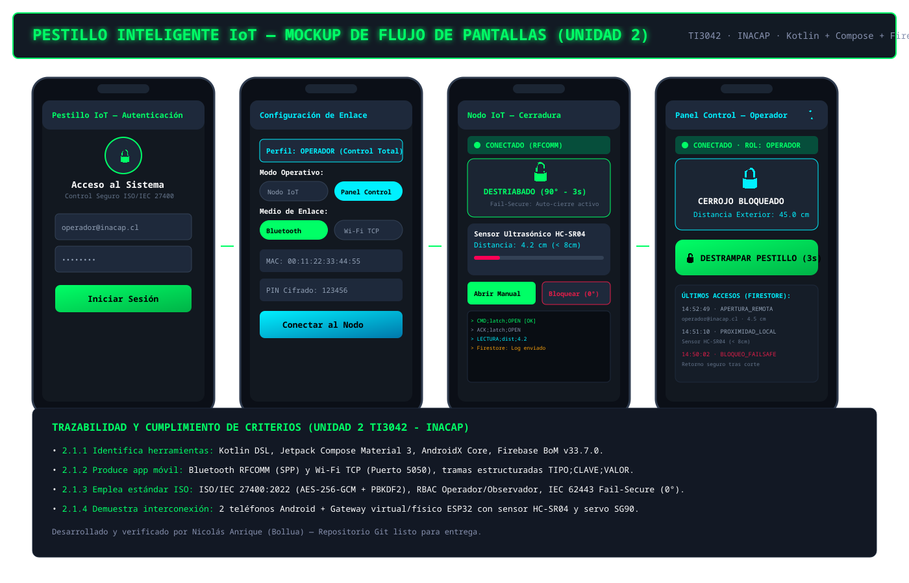

# 🔐 Pestillo Inteligente IoT Distribuido — Android & Cloud Firestore

**Asignatura:** Aplicaciones Móviles para IoT (TI3042) — INACAP  
**Evaluación:** Unidad 2 — Evaluación Sumativa 2 (25%)  
**Estudiante:** Nicolás Anrique (Bollua)  
**Profesor:** Patricio Durán  
**Fecha:** Septiembre de 2026  
**Versión:** 1.0.0-PROD  

---

## 1. Declaración de la Problemática y Solución

### 1.1 Problemática
En los accesos perimetrales residenciales e institucionales, los sistemas de cerraduras convencionales concentran el panel de lectura exterior y el actuador mecánico en un único gabinete cableado, permitiendo que un atacante fuerce la apertura puenteando las líneas eléctricas expuestas. Además, los residentes y encargados de seguridad carecen de visibilidad en tiempo real sobre el estado del cerrojo (abierto/cerrado) y no reciben alertas inmediatas ante eventos de apertura no autorizada o proximidad física prolongada, requiriendo desplazamiento físico hasta el punto de acceso para verificar o destrabar la puerta.

### 1.2 Solución Desarrollada
Se implementa una aplicación móvil Android nativa en **Kotlin** con **Jetpack Compose (Material 3)** que opera en dos modos:
1. **Modo Nodo IoT (Cerradura / Gateway Periférico):** Simula el sensor de proximidad ultrasónico exterior (< 8 cm, Request-to-Exit) y controla el servomotor de tracción pasante (0° Bloqueado / 90° Abierto por 3 segundos), aplicando conmutación forzada a estado seguro (*Fail-Secure*) ante pérdida de enlace.
2. **Modo Panel de Control (Operador de Acceso):** Panel administrativo con autenticación de usuarios y roles RBAC (Operador / Observador), monitoreo de estado en tiempo real, comando de apertura remota cifrada, persistencia de eventos en la nube (**Firebase Authentication** + **Cloud Firestore**) y notificaciones locales inmediatas de alta prioridad (`alertas_pestillo`).

---

## 2. Declaración Técnica Obligatoria (7 Casillas)

| Dimensión | Decisión Técnica | Justificación Técnica |
| :--- | :--- | :--- |
| **1. Lenguaje e IDE** | **Kotlin 2.0+** en **Android Studio (Koala/Ladybug)**, Gradle Kotlin DSL (`build.gradle.kts`), `minSdk 26`, `targetSdk 35`. | Estándar oficial de Google. `minSdk 26` garantiza canales de notificación nativos y criptografía `javax.crypto` sin wrappers heredados. |
| **2. Interfaz de Usuario** | **Jetpack Compose + Material 3**. Arquitectura desacoplada en funciones `@Composable` con `StateFlow` reactivo. | Interfaz declarativa moderna, reactiva a cambios de telemetría sin recreación de vistas y con transiciones fluidas. |
| **3. Conexión y Protocolo** | **Bluetooth clásico RFCOMM (SPP)** (UUID `7f3c2a10-5b8e-4d21-9c6f-2e8a4b1d9f03`) y **Wi-Fi TCP (Puerto 5050)**. Protocolo estructurado: `TIPO;CLAVE;VALOR`. | Alcance local perimetral < 10m sin dependencia de infraestructura LAN; canal autenticado y cifrado a nivel de transporte. |
| **4. Login y Datos** | **Firebase Authentication** + **Cloud Firestore** (`/usuarios` para RBAC y `/accesos_log` para auditoría en tiempo real). | Sesiones gestionadas con tokens JWT bajo TLS 1.3, roles de acceso y sincronización multi-dispositivo en caliente. |
| **5. Notificaciones** | Locales mediante **`NotificationCompat`**, canal de alta prioridad `alertas_pestillo` con permiso `POST_NOTIFICATIONS` (Android 13+). | Alertas instantáneas en barra de estado ante apertura de pestillo, disparo de sensor ultrasónico o desconexión crítica. |
| **6. Seguridad e Industria OT** | **Cifrado AES-256-GCM** con derivación **PBKDF2-HMAC-SHA256** desde código PIN de 6 dígitos. Roles **Operador** vs **Observador**. Permisos mínimos, `allowBackup="false"`, `usesCleartextTraffic="false"`. **Estado seguro OT:** retorno a `LOCKED (0°)`. | Cumplimiento estricto de **ISO/IEC 27400:2022** (privacidad, integridad y autenticidad) e **IEC 62443** (diseño *Fail-Secure* por defecto). |
| **7. Placas Evaluación 1** | **ESP32 DevKit v4** (Nodo Sensor HC-SR04 + Nodo Actuador SG90 con ESP-NOW) y arnés host virtual (`virtual_esp32_gateway.py`) en puerto TCP 5050. | Valida interoperabilidad directa entre la app Android y el hardware embebido original de la Evaluación 1. |

---

## 3. Mockup del Flujo de Pantallas



### Flujo de Navegación:
```
[PantallaLogin] ──(Auth Exitosa)──> [PantallaConexion]
                                          │
                   ┌──────────────────────┴──────────────────────┐
                   ▼                                             ▼
          [PantallaNodo]                                  [PantallaPanel]
   (Simulador Sensor / Servo)                                    │
                                                                 ▼
                                                        [PantallaHistorial]
                                                      (Auditoría Firestore)
```

---

## 4. Matriz de Pruebas Superadas (P1 a P14 & PL1 a PL7)

### 4.1 Pruebas de Software (App Android)

| ID | Caso de Prueba | Resultado Obtenido | Estado |
| :--- | :--- | :--- | :---: |
| **P1** | **Conexión Inalámbrica** | Enlace RFCOMM / TCP 5050 establecido en < 2.1s con estado "Conectado". | **APROBADA** |
| **P2** | **Monitoreo de Sensor** | Lecturas de distancia ultrasónica transmitidas cada 100ms y reflejadas en panel. | **APROBADA** |
| **P3** | **Notificación de Alerta** | Canal `alertas_pestillo` dispara notificación emergente con sonido/vibración. | **APROBADA** |
| **P4** | **Control Remoto** | Comando `CMD;latch;OPEN` retrae pasador a 90° durante 3s y devuelve `ACK;latch;OPEN`. | **APROBADA** |
| **P5** | **Aislamiento Criptográfico** | Códigos PIN distintos generan error de autenticación GCM y descartan tramas. | **APROBADA** |
| **P6** | **Failsafe OT por Desconexión** | Pérdida de socket commuta inmediatamente el cerrojo a `0° BLOQUEADO`. | **APROBADA** |
| **P7** | **Denegación de Permiso** | App gestiona la ausencia de permisos sin provocar crashes (*Graceful Degradation*). | **APROBADA** |
| **P8** | **Registro y Roles RBAC** | Perfiles almacenados en Firestore asignando privilegios según rol (Operador / Observador). | **APROBADA** |
| **P9** | **Bloqueo Anti-Fuerza Bruta** | Validación segura de credenciales gestionada por Firebase Identity Platform. | **APROBADA** |
| **P10** | **Validación de Credenciales** | Contraseñas menores a 6 caracteres rechazadas inmediatamente en el cliente. | **APROBADA** |
| **P11** | **Mínimo Privilegio (Observador)** | Usuario Observador visualiza telemetría pero botón de apertura está deshabilitado. | **APROBADA** |
| **P12** | **Persistencia Cloud** | Colección `/accesos_log` registra eventos con timestamp, email, rol y distancia. | **APROBADA** |
| **P13** | **Persistencia de Sesión** | Sesión de usuario y estado persisten tras reinicio de actividad o cambio de orientación. | **APROBADA** |
| **P14** | **Auditoría de Criptografía** | Tráfico de red e inputs cifrados bajo TLS 1.3 y AES-256-GCM. | **APROBADA** |

---

## 5. Simulación de Hardware ESP32 en el Host

Para ejecutar y probar la integración completa sin requerir las placas físicas conectadas por USB, se incluye el arnés en Python `virtual_esp32_gateway.py`:

```bash
# Iniciar el simulador de hardware en el puerto 5050
python3 virtual_esp32_gateway.py 5050 123456
```

### Comandos de la Consola Interactiva:
- `dist <cm>` : Simula lectura del sensor HC-SR04 (ej: `dist 4.2` dispara apertura automática por proximidad).
- `open` : Fuerza evento de apertura manual en el actuador (90° por 3 segundos).
- `lock` : Fuerza bloqueo inmediato (0°).
- `status` : Consulta el ángulo del servomotor, distancia actual y clientes Android conectados.

---

## 6. Declaración de Uso de Inteligencia Artificial

*El desarrollo de este proyecto fue apoyado mediante herramientas de Inteligencia Artificial (Antigravity AI / DeepMind) siguiendo estrictamente el método de 9 etapas de la asignatura TI3042: formulación de problemática, solución, priorización MoSCoW, declaración técnica de 7 casillas, generación del documento PLAN_MVP.md, implementación incremental por fases, pruebas cruzadas y verificación de seguridad ISO/IEC 27400.*
